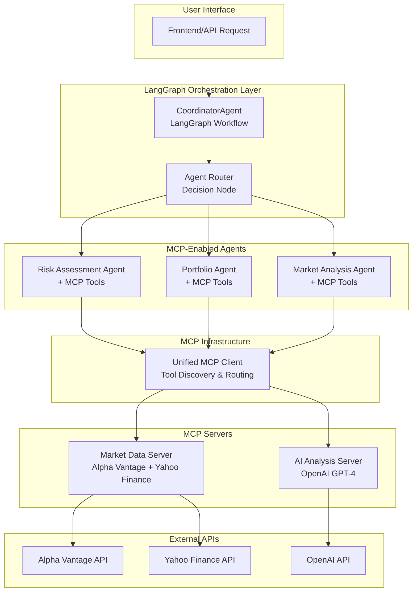

# MCP Integration Analysis for AgenticAI

## Current External API Architecture vs MCP

### Current Architecture (Direct API Calls)
```
AgenticAI Application
├── MarketDataService ──HTTP──> Alpha Vantage API
├── BaseAgent ──LangChain──> OpenAI API  
└── MarketDataService ──yfinance──> Yahoo Finance
```

### Proposed MCP Architecture
```
AgenticAI Application
├── MCP Client ──JSON-RPC──> MCP Server (Market Data)
├── MCP Client ──JSON-RPC──> MCP Server (AI Analysis)
└── MCP Client ──JSON-RPC──> MCP Server (Yahoo Finance)
```

## MCP Benefits for Your Application

### 1. **Standardized Tool Interface**
- **Current**: Each API has different authentication, rate limiting, error handling
- **With MCP**: Unified JSON-RPC interface for all external services

### 2. **Enhanced Security**
- **Current**: API keys stored in environment variables, exposed to application
- **With MCP**: API keys managed by MCP servers, not exposed to client application

### 3. **Better Resource Management**
- **Current**: Direct HTTP connections, manual rate limiting
- **With MCP**: MCP servers handle connection pooling, rate limiting, caching

### 4. **Simplified Error Handling**
- **Current**: Different error formats from each API
- **With MCP**: Standardized error responses across all services

## MCP Server Implementations Needed

### 1. **Market Data MCP Server**
```json
{
  "name": "market-data-server",
  "description": "MCP server for financial market data",
  "tools": [
    {
      "name": "get_stock_quote",
      "description": "Get real-time stock quote",
      "inputSchema": {
        "type": "object",
        "properties": {
          "symbol": {"type": "string"},
          "source": {"type": "string", "enum": ["alpha_vantage", "yahoo"]}
        }
      }
    },
    {
      "name": "get_historical_data",
      "description": "Get historical market data",
      "inputSchema": {
        "type": "object",
        "properties": {
          "symbol": {"type": "string"},
          "period": {"type": "string"},
          "interval": {"type": "string"}
        }
      }
    },
    {
      "name": "get_market_indices",
      "description": "Get major market indices data"
    }
  ]
}
```

### 2. **AI Analysis MCP Server**
```json
{
  "name": "ai-analysis-server",
  "description": "MCP server for AI-powered financial analysis",
  "tools": [
    {
      "name": "analyze_portfolio",
      "description": "Generate portfolio analysis and recommendations",
      "inputSchema": {
        "type": "object",
        "properties": {
          "user_profile": {"type": "object"},
          "market_data": {"type": "object"},
          "analysis_type": {"type": "string"}
        }
      }
    },
    {
      "name": "assess_risk",
      "description": "Perform risk assessment analysis"
    },
    {
      "name": "generate_market_insights",
      "description": "Generate market analysis and insights"
    }
  ]
}
```

## Implementation Strategy

### Phase 1: Create MCP Servers
1. **Market Data MCP Server** (Python)
   - Wraps Alpha Vantage and Yahoo Finance APIs
   - Handles authentication, rate limiting, caching
   - Provides unified market data interface

2. **AI Analysis MCP Server** (Python)
   - Wraps OpenAI API calls
   - Manages prompt templates and model configurations
   - Provides structured analysis tools

### Phase 2: Modify AgenticAI Client
1. **Replace Direct API Calls**
   ```python
   # Before (Direct API)
   async def get_market_data(self, symbols: List[str]) -> Dict:
       async with aiohttp.ClientSession() as session:
           # Direct Alpha Vantage call
   
   # After (MCP)
   async def get_market_data(self, symbols: List[str]) -> Dict:
       response = await self.mcp_client.call_tool(
           "get_stock_quote",
           {"symbols": symbols, "source": "alpha_vantage"}
       )
   ```

2. **Update Agent Tools**
   ```python
   # Before (LangChain Tools)
   tools = [
       Tool(
           name="get_market_summary",
           func=self.market_data_service.get_market_summary,
           description="Get market summary"
       )
   ]
   
   # After (MCP Tools)
   tools = await self.mcp_client.list_tools()
   ```

### Phase 3: Enhanced Features
1. **Tool Discovery**: Dynamically discover available tools from MCP servers
2. **Resource Management**: Automatic resource subscriptions and updates
3. **Prompt Templates**: Server-provided prompt templates for consistent AI interactions

## Code Examples

### MCP Client Integration
```python
"""
MCP Client for AgenticAI
"""
import asyncio
from mcp import Client, StdioServerParameters
from typing import Dict, Any, List

class AgenticAIMCPClient:
    def __init__(self):
        self.market_client = None
        self.ai_client = None
    
    async def initialize(self):
        """Initialize MCP clients"""
        # Market Data Server
        self.market_client = Client(
            server_params=StdioServerParameters(
                command="python",
                args=["-m", "market_data_server"]
            )
        )
        
        # AI Analysis Server  
        self.ai_client = Client(
            server_params=StdioServerParameters(
                command="python", 
                args=["-m", "ai_analysis_server"]
            )
        )
        
        await self.market_client.connect()
        await self.ai_client.connect()
    
    async def get_market_data(self, symbol: str) -> Dict[str, Any]:
        """Get market data via MCP"""
        result = await self.market_client.call_tool(
            "get_stock_quote",
            {"symbol": symbol, "source": "alpha_vantage"}
        )
        return result.content
    
    async def analyze_portfolio(self, user_profile: Dict, market_data: Dict) -> str:
        """Generate portfolio analysis via MCP"""
        result = await self.ai_client.call_tool(
            "analyze_portfolio",
            {
                "user_profile": user_profile,
                "market_data": market_data,
                "analysis_type": "comprehensive"
            }
        )
        return result.content
```

### Updated MarketDataService
```python
"""
Updated MarketDataService using MCP
"""
from .mcp_client import AgenticAIMCPClient

class MarketDataService:
    def __init__(self):
        self.mcp_client = AgenticAIMCPClient()
    
    async def get_market_data(self, symbols: List[str]) -> Dict:
        """Get market data via MCP server"""
        try:
            results = {}
            for symbol in symbols:
                data = await self.mcp_client.get_market_data(symbol)
                results[symbol] = data
            return results
        except Exception as e:
            logger.error(f"MCP market data error: {str(e)}")
            # Fallback to direct API if needed
            return await self._fallback_direct_api(symbols)
```

## Migration Benefits

### 1. **Improved Security**
- API keys isolated in MCP servers
- Reduced attack surface on main application

### 2. **Better Maintainability** 
- External API changes handled in MCP servers
- Standardized error handling and logging

### 3. **Enhanced Performance**
- Connection pooling and caching in MCP servers
- Reduced latency through persistent connections

### 4. **Easier Testing**
- Mock MCP servers for testing
- Consistent tool interfaces

### 5. **Future Extensibility**
- Easy to add new data sources as MCP servers
- Plugin architecture for new capabilities

## Implementation Timeline

### Week 1-2: MCP Server Development
- [ ] Create Market Data MCP Server
- [ ] Create AI Analysis MCP Server  
- [ ] Test servers independently

### Week 3-4: Client Integration
- [ ] Implement MCP client in AgenticAI
- [ ] Update MarketDataService to use MCP
- [ ] Update agent tools to use MCP

### Week 5-6: Testing & Migration
- [ ] End-to-end testing with MCP
- [ ] Performance comparison
- [ ] Gradual migration from direct APIs

### Week 7-8: Enhanced Features
- [ ] Dynamic tool discovery
- [ ] Resource subscriptions
- [ ] Advanced error handling

## Conclusion

MCP integration would provide your AgenticAI application with:
- **Standardized** external service interfaces
- **Enhanced security** through API key isolation
- **Better performance** through connection pooling and caching
- **Improved maintainability** with centralized external API management
- **Future-proofing** for adding new data sources and AI capabilities

The investment in MCP integration would pay off through reduced complexity, better security, and easier maintenance of your external API integrations. 

## Multi-Agent Flow with LangChain/LangGraph + MCP Integration

Let me explain the high-level flow of how our MCP-enabled multi-agent system works:

## 🏗️ **Overall Architecture Flow**



## 🔄 **Detailed Flow Explanation**

### **1. Request Initiation**
```python
# User Request Example
user_request = "I'm 35 years old with $100k income and moderate risk tolerance. 
                Create a comprehensive investment portfolio for me."
```

### **2. LangGraph Orchestration**
```python
# LangGraph Workflow Definition
class FinancialAdvisorWorkflow:
    def __init__(self):
        self.workflow = StateGraph(AgentState)
        
        # Add agent nodes
        self.workflow.add_node("risk_assessment", self.risk_assessment_node)
        self.workflow.add_node("market_analysis", self.market_analysis_node) 
        self.workflow.add_node("portfolio_generation", self.portfolio_generation_node)
        self.workflow.add_node("final_report", self.final_report_node)
        
        # Define flow
        self.workflow.add_edge(START, "risk_assessment")
        self.workflow.add_edge("risk_assessment", "market_analysis")
        self.workflow.add_edge("market_analysis", "portfolio_generation")
        self.workflow.add_edge("portfolio_generation", "final_report")
```

### **3. Agent Execution with MCP Tools**

#### **Step 1: Risk Assessment Agent**
```python
async def risk_assessment_node(state: AgentState):
    risk_agent = MCPRiskAssessmentAgent()  # MCP-enabled
    
    # Agent discovers available MCP tools automatically
    available_tools = await risk_agent.discover_mcp_tools()
    # Tools: ['assess_risk', 'analyze_portfolio', 'generate_market_insights']
    
    # Agent uses MCP tools through LangChain
    risk_analysis = await risk_agent.process_message(
        f"Assess risk for user: {state.user_profile}"
    )
    
    # Behind the scenes:
    # 1. LangChain agent decides to use 'assess_risk' tool
    # 2. MCP tool wrapper calls MCP client
    # 3. MCP client routes to AI Analysis Server
    # 4. AI Analysis Server calls OpenAI with specialized prompt
    # 5. Response flows back through the chain
    
    state.risk_assessment = risk_analysis
    return state
```

#### **Step 2: Market Analysis Agent**
```python
async def market_analysis_node(state: AgentState):
    market_agent = MCPMarketAnalysisAgent()
    
    # Agent uses multiple MCP tools in sequence
    market_analysis = await market_agent.process_message(
        "Analyze current market conditions for portfolio planning"
    )
    
    # Behind the scenes:
    # 1. Agent calls 'get_market_summary' via MCP
    # 2. MCP client routes to Market Data Server
    # 3. Market Data Server tries Alpha Vantage, falls back to Yahoo Finance
    # 4. Agent calls 'generate_market_insights' via MCP
    # 5. MCP client routes to AI Analysis Server for AI interpretation
    
    state.market_analysis = market_analysis
    return state
```

#### **Step 3: Portfolio Generation Agent**
```python
async def portfolio_generation_node(state: AgentState):
    portfolio_agent = MCPPortfolioAgent()
    
    # Agent combines all previous data using MCP tools
    portfolio = await portfolio_agent.process_message(
        f"""Generate portfolio allocation based on:
        - Risk Assessment: {state.risk_assessment}
        - Market Analysis: {state.market_analysis}
        - User Profile: {state.user_profile}"""
    )
    
    # Behind the scenes:
    # 1. Agent uses 'analyze_portfolio' MCP tool
    # 2. Combines risk + market + profile data
    # 3. AI Analysis Server generates optimal allocation
    # 4. Agent uses 'generate_investment_proposal' for specific recommendations
    
    state.portfolio_allocation = portfolio
    return state
```

## 🔧 **MCP Tool Discovery & Usage Flow**

### **Dynamic Tool Discovery**
```python
# Each agent automatically discovers available tools
class MCPEnabledAgent(BaseFinancialAgent):
    def __init__(self, mcp_tool_categories):
        # 1. Connect to MCP client
        self.mcp_client = mcp_client
        
        # 2. Discover available tools
        available_tools = self.mcp_client.get_available_tools()
        
        # 3. Filter tools by category
        agent_tools = []
        for category in mcp_tool_categories:
            if category in available_tools:
                for tool_name, tool_info in available_tools[category].items():
                    # 4. Wrap MCP tools as LangChain tools
                    langchain_tool = self._create_mcp_tool_wrapper(tool_name, tool_info)
                    agent_tools.append(langchain_tool)
        
        # 5. Initialize LangChain agent with MCP tools
        super().__init__(tools=agent_tools)
```

### **MCP Tool Execution**
```python
# When LangChain agent decides to use a tool
async def mcp_tool_wrapper(query: str, **kwargs):
    # 1. LangChain provides query and arguments
    # 2. Extract parameters for MCP call
    arguments = extract_arguments(query, kwargs)
    
    # 3. Route to appropriate MCP server
    if tool_name in ["get_stock_quote", "get_market_summary"]:
        server_type = "market_data"
    elif tool_name in ["analyze_portfolio", "assess_risk"]:
        server_type = "ai_analysis"
    
    # 4. Make MCP call
    result = await mcp_client.call_tool(tool_name, arguments, server_type)
    
    # 5. Format response for LangChain
    return format_for_langchain(result)
```

## 🎯 **Complete User Journey Example**

### **Input:** User Request
```
"I'm 35, earn $100k, have moderate risk tolerance. Create my investment portfolio."
```

### **Flow:**
1. **LangGraph Coordinator** receives request, initializes workflow state
2. **Risk Assessment Agent** (MCP-enabled):
   - Uses `assess_risk` MCP tool → AI Analysis Server → OpenAI
   - Result: "Risk Score: 6/10, Moderate tolerance confirmed"

3. **Market Analysis Agent** (MCP-enabled):
   - Uses `get_market_summary` → Market Data Server → Alpha Vantage/Yahoo
   - Uses `generate_market_insights` → AI Analysis Server → OpenAI  
   - Result: "Market bullish, favor growth stocks"

4. **Portfolio Agent** (MCP-enabled):
   - Uses `analyze_portfolio` with combined data → AI Analysis Server → OpenAI
   - Uses `generate_investment_proposal` → AI Analysis Server → OpenAI
   - Result: "50% stocks, 25% bonds, 25% diversified allocation"

5. **Final Report Generation**: Combines all agent outputs

### **Output:** Comprehensive Portfolio Recommendation
```json
{
  "risk_assessment": {
    "risk_score": 6,
    "tolerance": "Moderate",
    "capacity": "High"
  },
  "market_analysis": {
    "sentiment": "Bullish",
    "recommendation": "Growth-focused allocation"
  },
  "portfolio_allocation": {
    "stocks": 50,
    "bonds": 25,
    "real_estate": 15,
    "cash": 10
  },
  "specific_recommendations": [
    "VTI - Total Stock Market ETF",
    "BND - Total Bond Market ETF",
    "VNQ - Real Estate ETF"
  ]
}
```

## 🛡️ **Error Handling & Fallbacks**

### **Multi-Level Fallback Strategy**
```python
# 1. MCP Level: Server fallback
if alpha_vantage_fails:
    fallback_to_yahoo_finance()

# 2. Client Level: Direct API fallback  
if mcp_server_unavailable:
    fallback_to_direct_api_calls()

# 3. Agent Level: Alternative tools
if primary_tool_fails:
    try_alternative_mcp_tool()

# 4. Workflow Level: Skip non-critical steps
if market_data_unavailable:
    proceed_with_default_assumptions()
```

## 🚀 **Benefits of This Architecture**

### **1. Scalability**
- **Horizontal**: Add new MCP servers for additional data sources
- **Vertical**: Scale individual MCP servers independently

### **2. Maintainability** 
- **Separation of Concerns**: Business logic in agents, external APIs in MCP servers
- **Standardized Interfaces**: All external calls go through MCP protocol

### **3. Reliability**
- **Multiple Fallback Layers**: MCP server → Direct API → Default values
- **Graceful Degradation**: System continues with partial data

### **4. Security**
- **API Key Isolation**: Credentials only in MCP servers
- **Reduced Attack Surface**: Main application doesn't directly access external APIs

### **5. Extensibility**
- **Plugin Architecture**: New tools automatically discovered by agents
- **Dynamic Configuration**: Agents adapt to available tools

This architecture provides a robust, scalable, and maintainable foundation for multi-agent financial analysis with standardized external API access through MCP! 🎉 