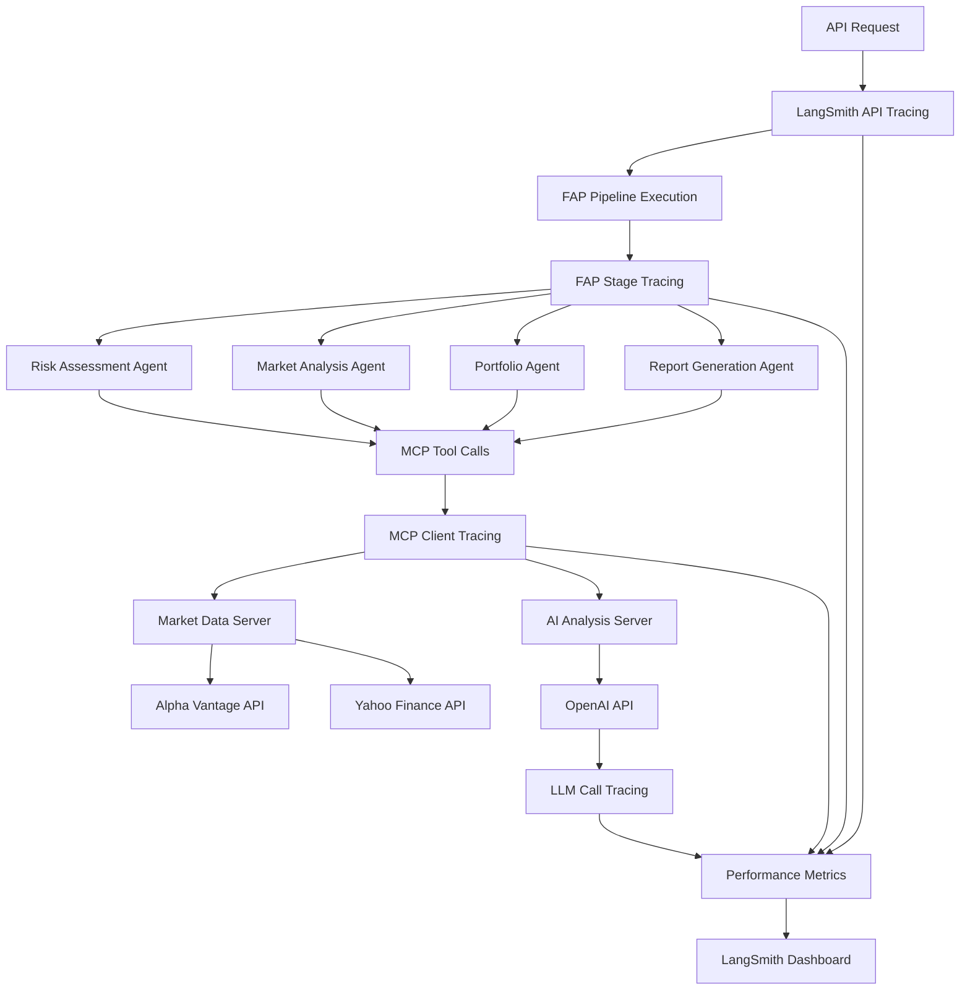

# LangSmith Integration Guide - Enhanced Comprehensive Tracing

## Overview

The Financial Investment Advisor Agent now includes **comprehensive LangSmith tracing** that captures:
- 🔹 **FAP Pipeline Execution** (all 4 stages)
- 🔹 **Individual LLM Calls** (OpenAI API interactions)
- 🔹 **Tool Executions** (MCP tool invocations)
- 🔹 **MCP Request/Response Cycles** (Model Context Protocol communications)
- 🔹 **API Endpoint Traces** (FastAPI request handling)
- 🔹 **Performance Metrics** (latency, token usage, success rates)
- 🔹 **Error Tracking** (comprehensive debugging information)

## Enhanced Tracing Architecture



## New Tracing Capabilities

### 1. **LLM Call Tracing** (`trace_llm_call`)
Captures every OpenAI API interaction with detailed metrics:

```python
@langsmith_service.trace_llm_call("portfolio_analysis")
async def analyze_portfolio():
    response = await llm.ainvoke(prompt)
    return response
```

**Traced Metrics:**
- Input/output text previews (PII sanitized)
- Token usage estimates
- Response latency
- Model parameters
- Success/failure status
- Error details

### 2. **Tool Execution Tracing** (`trace_tool_call`)  
Monitors all tool invocations including MCP tools:

```python
@langsmith_service.trace_tool_call("market_data_get_quote")
async def get_stock_quote():
    result = await tool_execution()
    return result
```

**Traced Metrics:**
- Tool name and arguments
- Execution duration
- Result type and preview
- Success/error status
- Input parameter sanitization

### 3. **MCP Request/Response Tracing** (`trace_mcp_request`)
Captures Model Context Protocol communications:

```python
@langsmith_service.trace_mcp_request("market_data", "get_stock_quote")
async def mcp_call():
    result = await mcp_server.call_tool()
    return result
```

**Traced Metrics:**
- Server type and tool name
- Request/response payloads (sanitized)
- Network latency
- API success indicators
- Data source information

## Comprehensive Trace Types

### FAP Pipeline Traces
| Trace Name | Description | Components |
|------------|-------------|------------|
| `fap_stage_risk_assessment` | Risk tolerance evaluation | User profile analysis, risk scoring |
| `fap_stage_market_analysis` | Market conditions analysis | Real-time data, trend analysis |
| `fap_stage_portfolio_generation` | Portfolio allocation | Asset allocation, diversification |
| `fap_stage_report_generation` | Final report creation | Recommendations, explanations |

### LLM Call Traces  
| Trace Name | Description | Model |
|------------|-------------|-------|
| `llm_portfolio_analysis` | Portfolio analysis generation | GPT-4 Turbo |
| `llm_risk_assessment` | Risk evaluation | GPT-4 Turbo |
| `llm_market_insights` | Market analysis | GPT-4 Turbo |
| `llm_investment_proposal` | Investment recommendations | GPT-4 Turbo |

### Tool Execution Traces
| Trace Name | Description | Tool Type |
|------------|-------------|-----------|
| `tool_market_data_get_stock_quote` | Stock quote retrieval | Market Data |
| `tool_ai_analysis_analyze_portfolio` | AI portfolio analysis | AI Analysis |
| `tool_plugin_compliance_check` | Compliance validation | Plugin |

### MCP Request/Response Traces
| Trace Name | Description | Server |
|------------|-------------|--------|
| `mcp_market_data_get_stock_quote` | Market data request | Market Data Server |
| `mcp_ai_analysis_analyze_portfolio` | AI analysis request | AI Analysis Server |

## Testing Comprehensive Tracing

### Run the Enhanced Test Suite

```bash
# Run comprehensive tracing test
python test_comprehensive_langsmith_tracing.py
```

This will generate traces for:
1. **FAP Pipeline** - All 4 stages with performance metrics
2. **MCP Client** - Market data + AI analysis with LLM calls
3. **Agent Tools** - Portfolio and market analysis agents
4. **API Endpoints** - FastAPI request handling

### Expected Trace Output

```
🚀 Starting Comprehensive LangSmith Tracing Tests
✅ LangSmith Project: financial-advisor-agent
📊 Executing FAP pipeline - watch LangSmith for traces!
📈 Testing Market Data Tool (MCP Request/Response tracing)
🤖 Testing AI Analysis Tool (LLM Call tracing)  
⚖️ Testing Risk Assessment Tool (LLM Call tracing)
👤 Testing Portfolio Agent with Tool Tracing
🚀 Testing FAP Analyze API Endpoint

🎉 COMPREHENSIVE TRACING TEST COMPLETED SUCCESSFULLY

📊 TRACING CAPABILITIES DEMONSTRATED:
✅ FAP Pipeline Tracing (4 stages)
✅ LLM Call Tracing (OpenAI API calls)
✅ Tool Execution Tracing (MCP tool calls)
✅ MCP Request/Response Tracing
✅ API Endpoint Tracing
✅ Performance Metrics Tracking
✅ PII Sanitization
✅ Error Tracking and Debugging
```

## LangSmith Dashboard Features

### Enhanced Trace Visualization
- **Nested Traces**: See complete request flow from API → FAP → Agents → MCP → OpenAI
- **Performance Metrics**: Latency histograms, token usage, success rates
- **Error Analysis**: Stack traces, failure patterns, debugging information
- **Input/Output Capture**: Sanitized request/response data

### Custom Filters
```
# Filter by trace type
component:llm
component:mcp  
component:tool
component:api

# Filter by operation
operation:portfolio_analysis
operation:risk_assessment
operation:market_data

# Filter by performance
duration_ms:>5000  # Slow operations
status:error       # Failed operations
```

### Performance Analytics
- **Latency Trends**: Track response times over time
- **Token Usage**: Monitor OpenAI API costs
- **Success Rates**: Identify reliability issues
- **Bottleneck Analysis**: Find performance constraints

## Enhanced Configuration

### Environment Variables
```bash
# Core LangSmith Configuration
LANGSMITH_API_KEY=lsv2_pt_your_api_key_here
LANGSMITH_TRACING=true
LANGSMITH_PROJECT=financial-advisor-agent
LANGSMITH_ENDPOINT=https://api.smith.langchain.com

# Enhanced Tracing Options
LANGSMITH_TRACE_LLM_CALLS=true
LANGSMITH_TRACE_TOOL_CALLS=true  
LANGSMITH_TRACE_MCP_REQUESTS=true
LANGSMITH_TRACE_API_ENDPOINTS=true

# Performance Monitoring
LANGSMITH_TRACK_PERFORMANCE=true
LANGSMITH_PERFORMANCE_THRESHOLD_MS=5000
LANGSMITH_SANITIZE_PII=true
LANGSMITH_ENABLE_EVALUATION=true
```

### Programmatic Configuration
```python
from src.services.langsmith_service import langsmith_service

# Configure enhanced tracing
langsmith_service.config.trace_llm_calls = True
langsmith_service.config.trace_tool_calls = True
langsmith_service.config.trace_mcp_requests = True
langsmith_service.config.performance_threshold_ms = 3000
```

## Privacy & Security Features

### PII Sanitization
Automatically removes sensitive information:
- **SSN**: `XXX-XX-XXXX`
- **Credit Cards**: `XXXX-XXXX-XXXX-XXXX`
- **Email**: `user@REDACTED.com`
- **Phone**: `XXX-XXX-XXXX`

### Data Filtering
- Request/response size limits (500 chars preview)
- Configurable metadata filtering
- Selective trace submission

### Compliance Features
- Audit trail logging
- Regulatory compliance scoring
- Data retention controls
- GDPR-compliant data handling

## Advanced Usage

### Custom Trace Decorators
```python
# Custom LLM tracing
@langsmith_service.trace_llm_call("custom_analysis")
async def my_llm_call():
    return await llm.ainvoke(prompt)

# Custom tool tracing  
@langsmith_service.trace_tool_call("custom_tool")
async def my_tool():
    return await tool_execution()

# Custom MCP tracing
@langsmith_service.trace_mcp_request("custom_server", "custom_tool")
async def my_mcp_call():
    return await mcp_client.call_tool()
```

### Performance Monitoring
```python
# Track custom metrics
await langsmith_service.track_performance_metrics(
    operation_name="custom_operation",
    duration_ms=1250,
    token_usage={"input_tokens": 100, "output_tokens": 200},
    success=True,
    metadata={"custom_field": "value"}
)
```

### Evaluation Integration
```python
# Run evaluations on traces
await langsmith_service.evaluate_financial_advice(
    advice_text="Investment recommendation...",
    user_profile={"risk_tolerance": "moderate"},
    market_conditions=market_data
)
```

## Troubleshooting

### Common Issues

**1. Traces Not Appearing**
```bash
# Check configuration
python -c "from src.services.langsmith_service import langsmith_service; print(langsmith_service.config)"

# Verify API key
curl -H "Authorization: Bearer $LANGSMITH_API_KEY" https://api.smith.langchain.com/projects
```

**2. Performance Issues**
```bash
# Check trace submission rate
grep "LangSmith" logs/backend_*.log | grep "trace"

# Monitor API quotas
# View dashboard: https://smith.langchain.com/settings/usage
```

**3. Missing MCP Traces**
```bash
# Verify MCP client initialization
python -c "from src.mcp_clients.mcp_client import mcp_client; print(mcp_client.connected)"

# Check MCP tool availability
python -c "from src.mcp_clients.mcp_client import mcp_client; import asyncio; asyncio.run(mcp_client.initialize()); print(mcp_client.get_available_tools())"
```

## Dashboard URLs

- **Main Dashboard**: https://smith.langchain.com/projects/p/financial-advisor-agent
- **Performance Analytics**: https://smith.langchain.com/projects/p/financial-advisor-agent/analytics
- **Evaluation Results**: https://smith.langchain.com/projects/p/financial-advisor-agent/evaluations

## Best Practices

### 1. **Trace Naming Conventions**
- Use consistent prefixes: `fap_`, `llm_`, `tool_`, `mcp_`, `api_`
- Include operation type: `portfolio_analysis`, `risk_assessment`
- Add context: `market_data_get_quote`, `ai_analysis_assess_risk`

### 2. **Performance Optimization**
- Set appropriate thresholds for slow operations (5000ms default)
- Use sampling for high-volume operations
- Monitor token usage and API costs

### 3. **Security Guidelines**
- Always enable PII sanitization in production
- Review trace data for sensitive information
- Configure appropriate data retention policies
- Use environment variables for API keys

### 4. **Monitoring & Alerting**
- Set up alerts for error rates > 5%
- Monitor response times > threshold
- Track evaluation score trends
- Review compliance metrics regularly

## Integration Examples

### Complete Request Flow Tracing
```python
# API Request → FAP Pipeline → Agents → MCP → OpenAI
@langsmith_service.trace_api_endpoint("fap_analyze")
async def analyze_financial_profile(user_profile):
    # This creates a complete trace hierarchy:
    # api_fap_analyze
    # ├── fap_stage_risk_assessment  
    # │   ├── tool_ai_analysis_assess_risk
    # │   │   ├── mcp_ai_analysis_assess_risk
    # │   │   │   └── llm_risk_assessment
    # ├── fap_stage_market_analysis
    # │   ├── tool_market_data_get_quote
    # │   │   └── mcp_market_data_get_quote
    # ├── fap_stage_portfolio_generation
    # │   ├── tool_ai_analysis_analyze_portfolio
    # │   │   ├── mcp_ai_analysis_analyze_portfolio
    # │   │   │   └── llm_portfolio_analysis
    # └── fap_stage_report_generation
    #     ├── tool_ai_analysis_generate_proposal
    #     │   ├── mcp_ai_analysis_generate_proposal
    #     │   │   └── llm_investment_proposal
    
    pipeline = FAPPipeline()
    result = await pipeline.execute(FAPContext(user_profile=user_profile))
    return result
```

This comprehensive tracing provides complete visibility into every aspect of the Financial Investment Advisor Agent's operation, enabling detailed performance analysis, debugging, and quality assurance. 